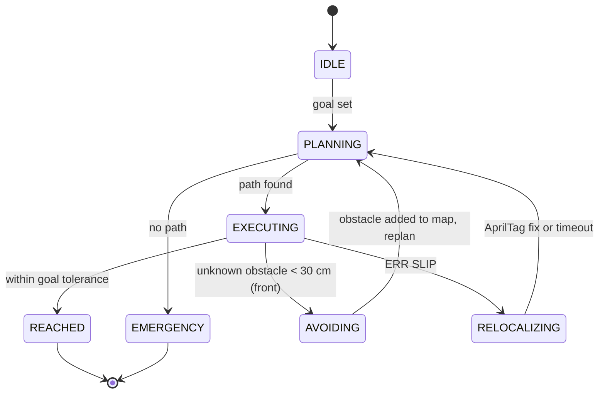

# Architecture

Layered design, built bottom-up. Lower layers expose stable APIs; higher layers
consume them. Each layer is fully tested before the next begins.

```
Layer 6  UI & Logging          Flask + WebSocket + matplotlib
Layer 5  Navigation            state machine: plan / execute / recover
Layer 4  Localization          wheel odometry + AprilTag -> EKF
Layer 3  Algorithms            occupancy grid, A*, smoothing, pure pursuit
Layer 2  I/O Abstraction       RobotComms, Camera, AprilTagDetector (+Real/Sim)
Layer 1  ESP32 Firmware        C++, compiled & host-tested (flashed in Phase 7)
Layer 0  Simulation Core       World model, physics, sensor noise, ground truth
```

## Dependency injection seam

Production code depends only on abstract interfaces. `autoproject.factory` reads
`config/runtime.yaml` (`mode: sim | real`) and constructs the matching
implementations. Swapping simulation for hardware is a config change.

## Interface contracts (Layer 2 — implemented)

- **`IRobotComms`** — `move(left_mps, right_mps)`, `stop()`, `get_telemetry() ->
  Telemetry | None`; callback registration `on_obstacle`, `on_slip`, `on_done`.
- **`ICamera`** — `get_frame() -> np.ndarray` (H×W×3 uint8 BGR).
- **`IAprilTagDetector`** — `detect(frame) -> list[Detection]` with
  `Detection(tag_id, center_px, range_m, bearing_rad)`.

Each has a `Sim*` implementation (queries the Layer 0 `World`) and a `Real*`
implementation (hardware: pyserial / OpenCV / pupil-apriltags). `Real*` modules
are written and import-checked but executed only in `mode: real` (Phase 7).

`autoproject.factory` builds the selected family: `build_robot_comms`,
`build_camera`, `build_detector` read `runtime.yaml` (global `mode` + optional
per-component overrides) and lazily import the concrete classes, so a
simulation-only host needs no hardware libraries installed.

## Navigation state machine (Layer 5)

States: `IDLE / PLANNING / EXECUTING / AVOIDING / RELOCALIZING / EMERGENCY /
REACHED`. Source: `docs/figures/nav_state_machine.mmd`.



Notes:
- The reactive layer reacts only to *unknown* obstacles (known map features are
  expected and the planned path already clears them). A detected unknown obstacle
  is added to the planning grid and the robot replans around it.
- `RELOCALIZING` waits for a fresh AprilTag fix to correct the fused pose, but
  falls back to replanning from odometry after a timeout so it never deadlocks; a
  cooldown then suppresses repeated slip events.
- Goal reached: `||pose - goal|| < 5 cm` and `|θ - θ_goal| < 5°` (rotate-in-place
  for the final heading).

## UART link (Layer 1 ↔ Layer 2)

The ESP32 ↔ RPi text protocol is specified in [`uart_protocol.md`](uart_protocol.md).
